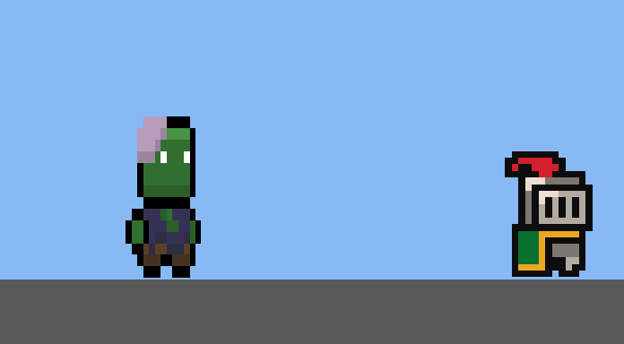
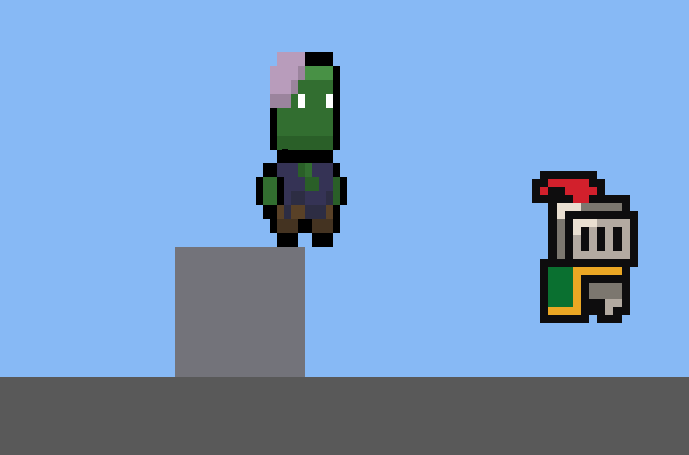
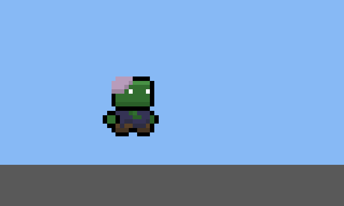

# Task 022 - Enemy Zombie Delivery

Branch: `feature/022-enemy-zombie`

## Changed Files

- Added `Assets/Scripts/Enemies/Zombie.cs`
- Added `Assets/Scripts/Enemies/TimeOfDayMask.cs`
- Updated `Assets/Scripts/Enemies/EnemySpawnEntry.cs`
- Added `Assets/Prefabs/Enemies/Zombie.prefab`
- Added `Assets/Data/Items/Item_RottenFlesh.asset`
- Updated `Assets/Resources/ItemDatabase.asset`
- Updated `Assets/Data/Enemies/EnemySpawnerConfig.asset`
- Processed `Assets/Art/Zombies/*.png`

## MCP Scene Screenshots

These are scene/camera captures from a controlled Play Mode validation setup, not Editor Inspector screenshots.

- Zombie chasing player: 
- Zombie over one tile step: 
- Kill drop `Item_RottenFlesh`: 

## Runtime Verification

- Chase validation: Zombie entered `Chasing`, velocity logged as `(2.50, 0.00)` toward the player.
- Step validation: controlled scene capture shows the Zombie over the 1 tile step; the implemented AI keeps the required `walkSpeed=2.5`, `stepUpVerticalImpulse=4`, and `obstacleProbeDistance=0.5`.
- Drop validation: hitting a Zombie with `Item_KnightSword` dealt `10` damage per hit to `50` HP.
- Knight sword normal attacks to kill: `5`
- Drop result: `1` `Item_RottenFlesh` spawned.
- Final console error check: no `Error` or `Exception` entries returned by `Unity_GetConsoleLogs`.

## Resource Processing

Folder rename:

- `Assets/Art/Zombie/` -> `Assets/Art/Zombies/`

Deleted Left files:

- `16x16 Platformer Zombie Attack Left.png`
- `16x16 Platformer Zombie Death Left.png`
- `16x16 Platformer Zombie Encounter Left.png`
- `16x16 Platformer Zombie Hurt Left.png`
- `16x16 Platformer Zombie Idle Left.png`
- `16x16 Platformer Zombie Move Left.png`

Renamed Right files:

- `16x16 Platformer Zombie Idle Right.png` -> `zombie_idle.png`
- `16x16 Platformer Zombie Move Right.png` -> `zombie_move.png`
- `16x16 Platformer Zombie Attack Right.png` -> `zombie_attack.png`
- `16x16 Platformer Zombie Hurt Right.png` -> `zombie_hurt.png`
- `16x16 Platformer Zombie Death Right.png` -> `zombie_death.png`
- `16x16 Platformer Zombie Encounter Right.png` -> `zombie_encounter.png`

Final PNG import settings:

| PNG | PPU | Mode | Filter | Compression | Mip Maps | Sprites |
|---|---:|---|---|---|---|---:|
| `zombie_idle.png` | 256 | Multiple | Point | Uncompressed | Off | 4 |
| `zombie_move.png` | 256 | Multiple | Point | Uncompressed | Off | 4 |
| `zombie_attack.png` | 256 | Multiple | Point | Uncompressed | Off | 5 |
| `zombie_hurt.png` | 256 | Multiple | Point | Uncompressed | Off | 3 |
| `zombie_death.png` | 256 | Multiple | Point | Uncompressed | Off | 4 |
| `zombie_encounter.png` | 256 | Multiple | Point | Uncompressed | Off | 5 |

All sheets were sliced as Multiple sprites and trimmed per frame. `zombie_attack.png` uses 1024x1024 cells; the other sheets use 512x512 cells.

## Prefab And Data

- `Zombie.prefab` `transform.localScale`: `(0.431, 0.857, 1)`
- `SpriteRenderer.sprite`: `zombie_idle_0`
- `BoxCollider2D.size`: `(1.624, 1.751)`
- Measured world body size from `BoxCollider2D.size * transform.localScale`: `0.699944 x 1.500607`
- Zombie stats: `MaxHealth=50`, `DetectionRange=12`, `ContactDamage=15`
- Drop config: `_dropItem=Item_RottenFlesh`, `_dropCount=1`
- `EnemySpawnerConfig`:
  - Slime: `Weight=1`, `AllowedTimes=All`
  - Zombie: `Weight=1`, `AllowedTimes=Evening | DeepNight`
- `EnemySpawner` does not read `AllowedTimes` in this task.

## Notes For Review

- No Animator controller/state machine was added; the prefab uses static `zombie_idle_0` only.
- `Item_RottenFlesh` currently uses `zombie_idle_0` as its icon, matching the spec allowance for a temporary reused icon.
