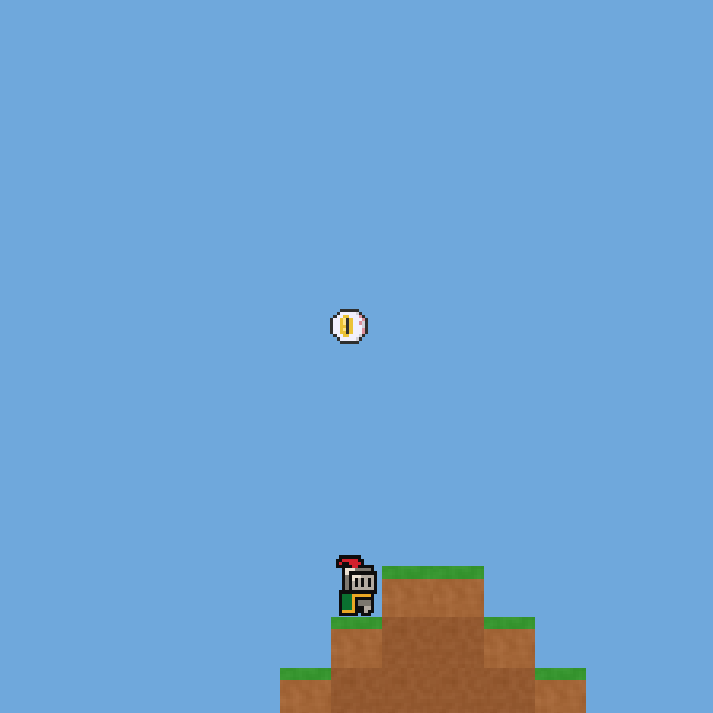
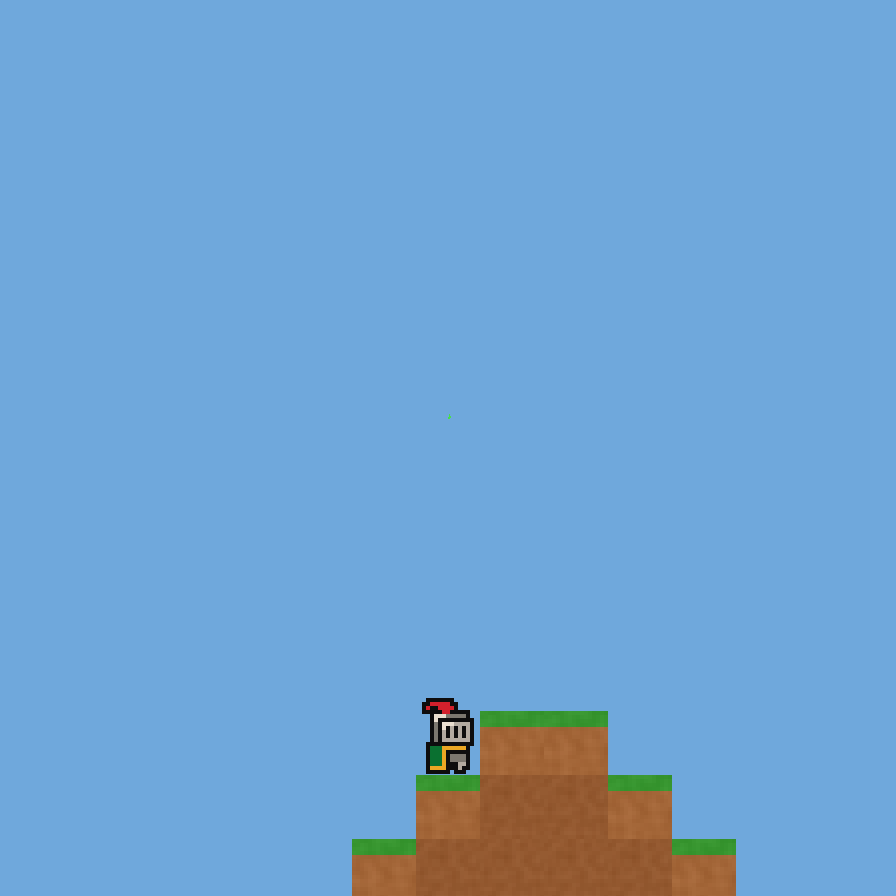

# Task 023 - Boss Enemy And Summon System Delivery

Branch: `feature/023-boss-and-summon`

## Changed Files

- Added `Assets/Scripts/Enemies/Boss/EyeOfCorruption.cs`
- Added `Assets/Scripts/Enemies/Boss/BossSpawner.cs`
- Added `Assets/Prefabs/Enemies/EyeOfCorruption.prefab`
- Added `Assets/Prefabs/Enemies/Spawners/EyeOfCorruptionSpawner.prefab`
- Added `Assets/Prefabs/Projectiles/AcidProjectile.prefab`
- Added `Assets/Data/Items/Item_SuspiciousEye.asset`
- Added `Assets/Data/Items/Item_CorruptShard.asset`
- Updated `Assets/Scripts/Items/ItemType.cs`
- Updated `Assets/Scripts/Items/ItemData.cs`
- Updated `Assets/Scripts/Player/PlayerCombat.cs`
- Updated `Assets/Scripts/Player/PlayerBlockInteraction.cs`
- Updated `Assets/Scripts/Combat/Projectile.cs`
- Updated `Assets/Scripts/Enemies/Enemy.cs`
- Updated `Assets/Scripts/Save/SaveData.cs`
- Updated `Assets/Resources/ItemDatabase.asset`
- Updated `Assets/Art/Sprites/Enemies/Boss/EyeOfCorruption/Eye Monster Sprite Sheet.png.meta`

## MCP Screenshots

These were captured from controlled Unity MCP Play Mode validation states.

- Summon moment: 
- Phase 1 idle animation: 
- Phase 2 detect animation: 
- Phase 2 acid barrage: 
- Kill drop: 

## Runtime Verification Log

- Import check: `Sprite Mode=Multiple`, `PPU=32`, `Filter=Point`, `Compression=Uncompressed`, `MipMaps=False`.
- Prefab check: `EyeOfCorruption` scale is `2`, `AcidProjectile` has `Projectile`, acid sprite is `EyeOfCorruption_24`.
- New save default: `SaveData.CreateNewGameDefault()` puts `Item_SuspiciousEye` item id `35` in Slot[2] with count `1`.
- Summon use: `PlayerCombat` consumable path returned `True`; Slot[2] became empty; Boss spawned at +8.00 world Y in the immediate summon check.
- Boss is independent from `EnemySpawner`: `EnemySpawner.AliveCount` stayed `0 -> 0` after direct Boss summon.
- Phase 1 hover animation: logged sprite `EyeOfCorruption_02`, which is Row 0 idle.
- Phase switch log: MCP forced HP across threshold with `phaseSwitchHp=400->195`; phase changed to Phase 2 and detect sprite logged as `EyeOfCorruption_09`, which is Row 1 detect.
- Phase 2 acid barrage: projectile appeared after `43` MCP frame steps from the Phase 2 detect capture point; isolated acid hit changed player health `100 -> 88`, confirming `12` damage.
- Boss contact damage: overlap check changed player health `100 -> 75`, confirming `25` contact damage.
- Kill/drop: HP `195 -> 0`, Boss destroyed after the 1 second shrink routine, and `Item_CorruptShard` spawned as one drop stack with count `3`.
- Knight sword combat duration: MCP harness used `PlayerCombat.EvaluateHits` with `Item_KnightSword` stats; `40` hits at `10` damage, `0.35s` swing duration, `14.00s` to HP 0, and drop count `3` after death.
- Console check: no compile errors or runtime errors; only unrelated Unity AI Toolkit account-access warnings were present.

## Implementation Notes

- `EyeOfCorruption` inherits `Enemy` but keeps its own internal `BossPhase` enum, so the shared `EnemyState` enum was not expanded.
- Animation is driven by direct `SpriteRenderer.sprite` swapping. No Animator Controller was added.
- Phase 1 hover uses Row 0 frames `0-7`; Phase 2 hover uses Row 1 frames `8-11`; acid wind-up uses Row 2 frames `16-23`; `AcidProjectile` uses frame `24`.
- `BossSpawner` directly instantiates `EyeOfCorruption.prefab`; it does not register the Boss with `EnemySpawner`.
- `Projectile` now performs a `TargetLayer` overlap check in addition to collision callbacks. This preserves the existing `Projectile x Player` collision matrix while allowing enemy-owned projectiles to damage the player.
- Boss 素材来源：Elthen's Pixel Art Shop (itch.io)，免费授权

## Review Focus

- Check `EyeOfCorruption` phase timers and Row 0/Row 1 visual distinction.
- Check `PlayerCombat` consumable dispatch and cooldown behavior.
- Check `Projectile` overlap hit path for enemy-owned acid projectiles and existing player projectiles.
- Check Unity serialized references on Boss, BossSpawner, AcidProjectile, and the two new ItemData assets.

## Known Notes

- The KnightSword duration was measured with an MCP-controlled combat harness because mouse-device input is not reliable in paused Unity MCP Play Mode. The harness uses the real `PlayerCombat.EvaluateHits` path and `Item_KnightSword` serialized stats.
