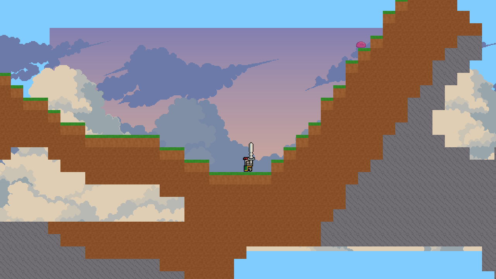
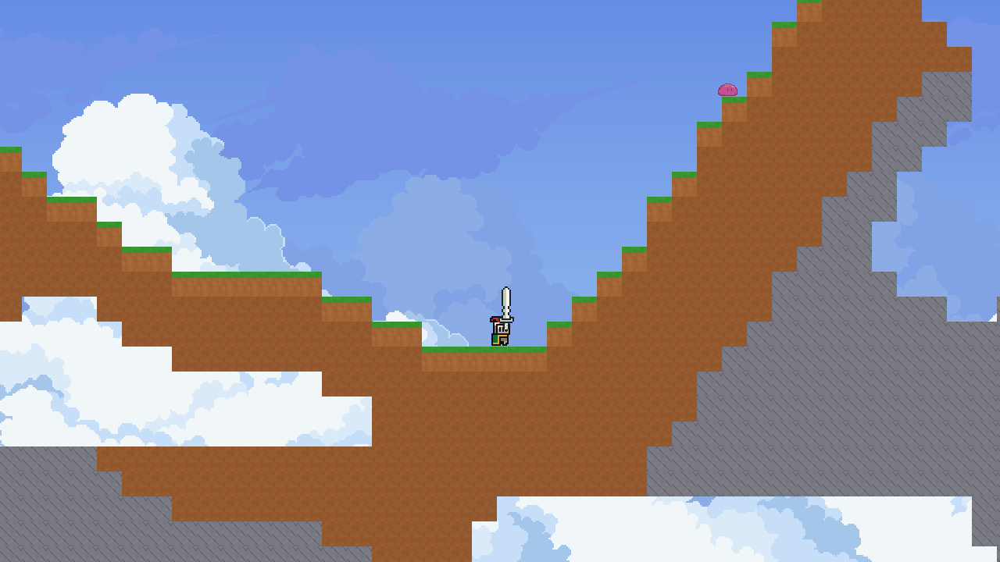
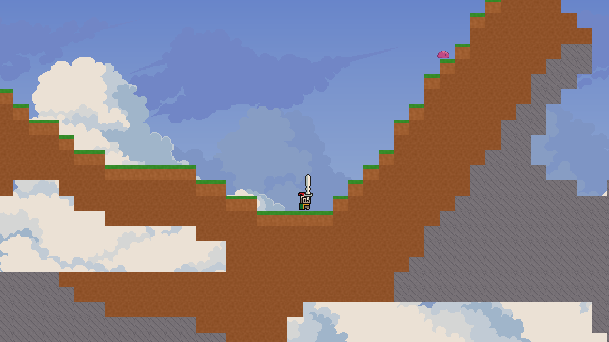
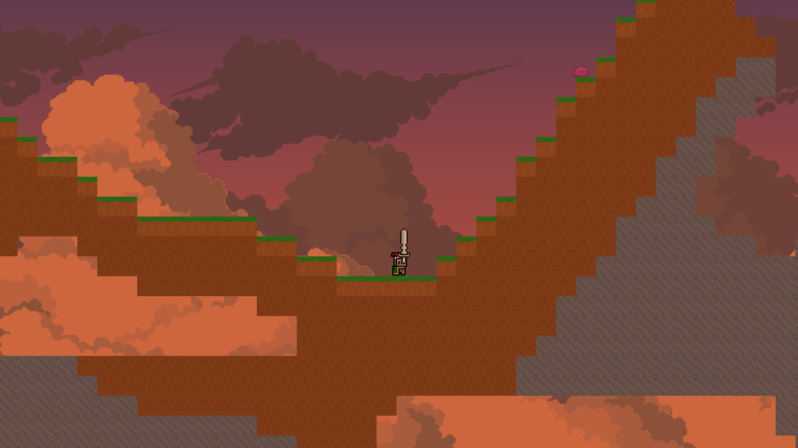
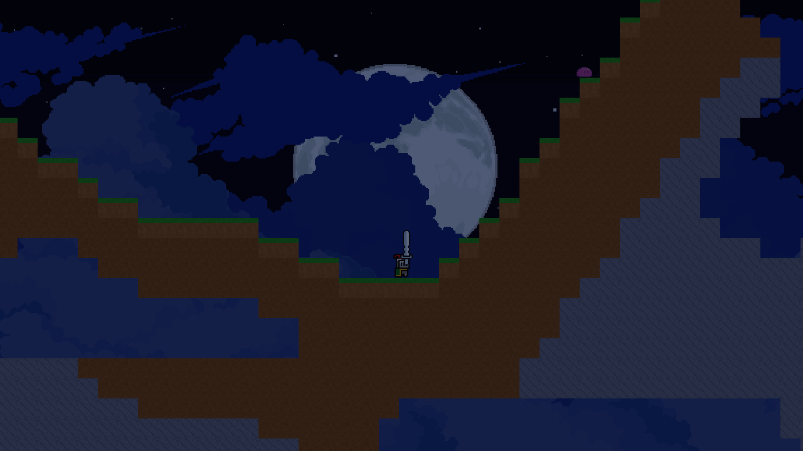
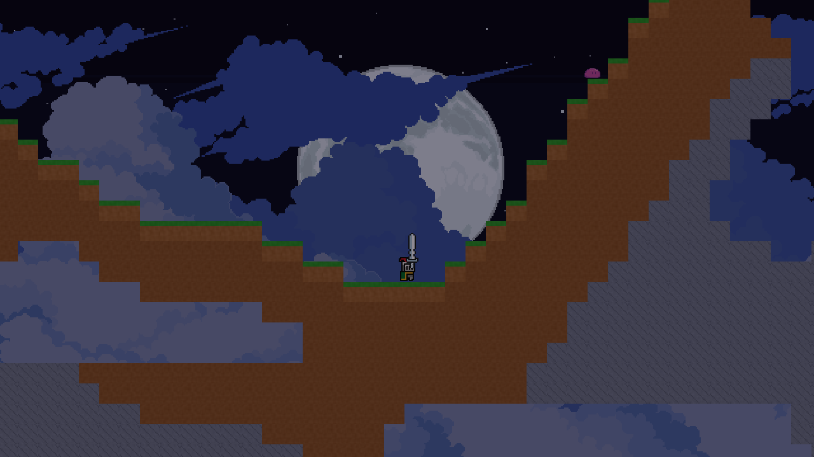
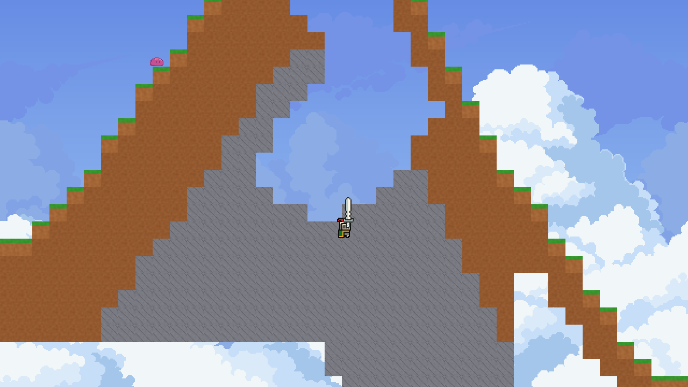
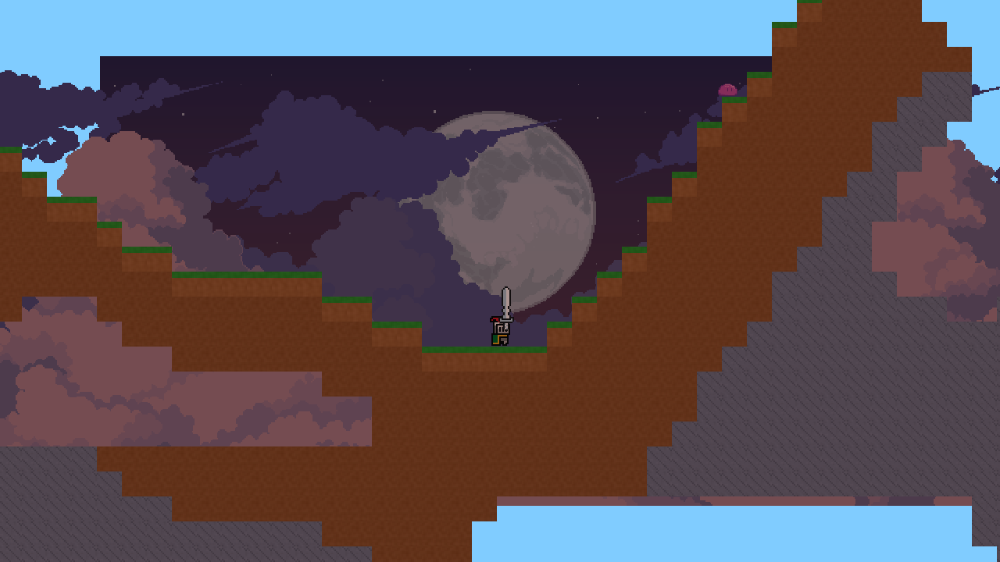
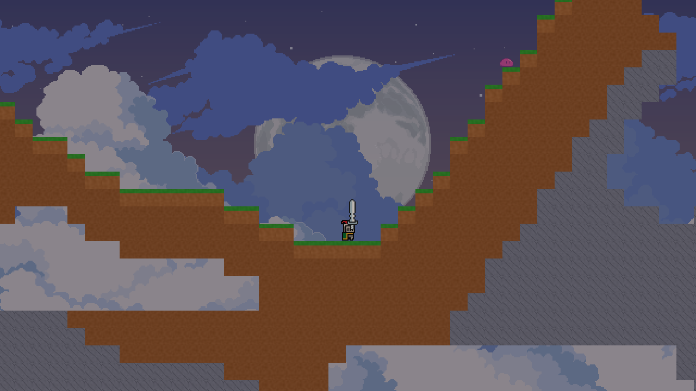

# Task 025 - Day Night Cycle Delivery

Branch: `feature/025-day-night-cycle`

## Changed Files

- Added `Assets/Scripts/World/Time/TimeOfDay.cs`
- Added `Assets/Scripts/World/Time/WorldClock.cs`
- Added `Assets/Scripts/World/Time/GradientSampler.cs`
- Added `Assets/Scripts/World/Time/WorldLightingDirector.cs`
- Added `Assets/Scripts/World/Time/SkyGradient.cs`
- Added `Assets/Scripts/World/Time/ParallaxCloudLayer.cs`
- Added `Assets/Scripts/Save/TimeSaveData.cs`
- Added background sprites under `Assets/Art/Backgrounds/`
- Updated `Assets/Scenes/SampleScene.unity`
- Updated `Assets/Scripts/Enemies/EnemySpawner.cs`
- Updated `Assets/Scripts/Save/SaveData.cs`
- Updated `Assets/Scripts/Save/GameStateSnapshot.cs`
- Updated task docs and task board

## MCP Screenshots

- Morning 06:00: 
- Noon 10:00: 
- Afternoon 14:00: 
- Evening 18:00: 
- DeepNight 22:00: 
- Dawn 05:00: 
- Parallax before move: 
- Parallax after move: 
- Sunset fade 19:00: 
- Dawn fade 05:30: 

## Runtime Verification Log

- Compile/import: `AssetDatabase.Refresh()` completed with `isCompiling=False`; final Console check returned `0 error / 0 warning`.
- Scene bindings: `WorldClock=True`, `SkyGradient=True`, `WorldLightingDirector=True`, `Light2D=True`, `ParallaxCloudLayer count=3`.
- Sky refs: `_skyFill=SkyFill`, `_skyTop=SkyTop`, `_starfield=Starfield`, `_moon=Moon`, `_cloudLayers=3`.
- Cloud refs and factors: `CloudFar factor=0.08 wind=0.10`, `CloudMid factor=0.15 wind=0.16`, `CloudNear factor=0.25 wind=0.22`.
- Import settings: all five background PNGs are `Sprite/Single`, `Filter=Point`, `Compression=Uncompressed`; cloud layers use `Wrap=Repeat`.
- Time boundaries: `0=DeepNight`, `360=Morning`, `600=Noon`, `840=Afternoon`, `1080=Evening`, `1320=DeepNight`.
- Time events: `DeepNight->Morning`, `Morning->Noon`, `Noon->Afternoon`, `Afternoon->Evening`, `Evening->DeepNight`.
- Lighting and night alpha samples:
  - `06:00 Morning`: light `0.85`, night alpha `0`
  - `10:00 Noon`: light `1.00`, night alpha `0`
  - `14:00 Afternoon`: light `0.95`, night alpha `0`
  - `18:00 Evening`: light `0.70`, night alpha `0`
  - `19:00 Evening fade`: light `0.575`, night alpha `0.5`
  - `22:00 DeepNight`: light `0.35`, night alpha `1`
  - `05:30 dawn fade`: light `0.675`, night alpha `0.5`
- Parallax proof: camera/player moved `20` world units; cloud movement was `CloudFar=1.6`, `CloudMid=3.0`, `CloudNear=5.0`, all lower than player movement with near clouds moving fastest.
- Pause freeze: with `Time.timeScale=0`, clock stayed `600 -> 600` and `CloudFarX` stayed `-6.669 -> -6.669`.
- Save roundtrip: captured `GameMinutes=1234`, reset clock to `360`, applied snapshot, restored `1234` (`Evening`).
- Enemy spawn filter harness:
  `Morning slime=20 zombie=0 | Noon slime=20 zombie=0 | Afternoon slime=20 zombie=0 | Evening slime=14 zombie=16 | DeepNight slime=19 zombie=11`.

## Review Focus

- Check `WorldClock` boundaries and save/load interaction with `GameStateSnapshot`.
- Check `GradientSampler` wrap-around interpolation for the `22:00 -> 02:00` overnight interval.
- Check `SkyGradient` runtime sprite generation and camera-fit behavior for `SkyFill` and `SkyTop`.
- Check `ParallaxCloudLayer` horizontal wrapping for long camera movement.
- Check `EnemySpawner` time mask filtering and default `WorldClock.Instance == null` fallback to Noon.

## Known Notes

- Runtime validation used paused Play Mode and direct frame/application of visual update methods because Unity MCP background wall-clock waits are not reliable for elapsed-time checks.
- The spawn filter harness used a temporary camera, player, ground collider, cloned `EnemySpawnerConfig`, and the real Slime/Zombie prefabs; all temporary objects were destroyed after each window.
