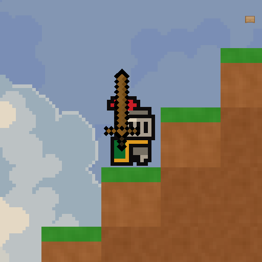
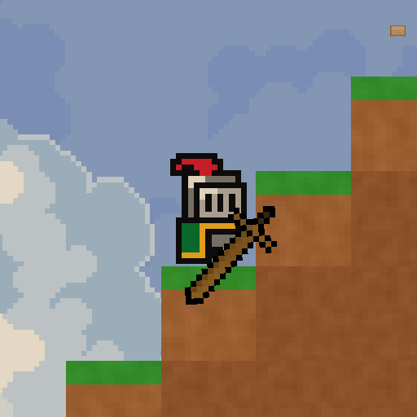

# Task 026 - Crafting System Delivery

Branch: `feature/026-crafting-system`

## Changed Files

- Added crafting scripts: `Recipe`, `CraftingService`, `WorkbenchProximity`.
- Added UI script: `RecipeSlotUI`; updated `InventoryUI` to show and click 4 recipes inside the inventory panel.
- Updated item/world code: `Inventory.CountItem`, `ItemData.IconAngleOffset`, `PlayerCombat` rotation offset, `BlockType.Workbench`, `TileRegistry`.
- Added/generated assets: `weapon_wood_sword.png`, `workbench.png`, `WorkbenchTile.asset`, `Item_WoodSword.asset`, `Item_Workbench.asset`, 4 `Recipe_*.asset` files.
- Updated registries: `ItemDatabase.asset`, `TileRegistry.asset`, `BlockDataRegistry.asset`, `BlockDataRegistry.csv`.
- Updated `SampleScene.unity` with the crafting recipe panel and `WorkbenchProximity` bindings.
- Added `docs/credits.md` for Vollrat CC-BY 3.0 and Kenney CC0 attribution.

## MCP Screenshots

- Wood sword static orientation: 
- Wood sword swing orientation: 

## Runtime Verification Log

- Compile/import: `AssetDatabase.Refresh()` completed with `isPlaying=False`, `isCompiling=False`, `isUpdating=False`.
- Final Console errors: `0`.
- Final Console warnings: `1`, from Unity AI/Account package token accessibility (`Account API did not become accessible within 30 seconds`), unrelated to task code/assets.
- Asset validation: `True`.
  `Item_WoodSword id=38 dmg=5 range=1.3 swingDuration=0.42 knockback=3 iconOffset=45`.
  `Item_Workbench id=39 placeBlock=Workbench hardness=0.4 dropChance=1`.
- Recipe assets:
  `Recipe_Workbench => Workbench`, `Recipe_WoodSword => Wood Sword`, `Recipe_WoodArrow => Arrow`, `Recipe_WoodPickaxe => Wood Pickaxe`.
- Inventory UI bindings:
  `_recipes=4`, `_recipeSlots=4`, `_workbenchProximity=InventoryRoot`.
- `Inventory.CountItem`: `wood=30`, `null=0`, result `True`.
- Station gating:
  before placement `nearWorkbench=False`, `woodSwordCanCraft=False`;
  after placement `nearWorkbench=True`, `woodSwordCanCraft=True`.
- Crafting loop:
  started with `30` Wood;
  craft workbench succeeded, Wood `30 -> 20`, Workbench count `1`;
  placed Workbench at cell `(2, 38, 0)`, block became `Workbench`, inventory Workbench `0`;
  craft Wood Sword: Wood `20 -> 13`, Wood Sword `1`;
  craft Arrow: Wood `13 -> 12`, Arrow `5`;
  craft Wood Pickaxe: Wood `12 -> 4`, Wood Pickaxe `1`.
- InventoryUI click path:
  `RecipeSlotUI` click while inventory open crafted Workbench, Wood `10 -> 0`, Workbench `1`.
- Existing placement path:
  `PlayerBlockInteraction.PlaceBlock` with selected `Item_Workbench` placed at `(2, 29, 0)`, `before=Air`, `after=Workbench`, inventory Workbench `0`, selected `PlaceBlockType=Workbench`.
- Save/load restoration:
  saved Workbench at cell `(2, 38, 0)` / world data `(202, 138)` through `SaveSystem.Save`;
  loaded snapshot had `PlayerEdits.Count=1` and target `BlockType=6`;
  after clearing the cell to `Air`, `GameStateSnapshot.Apply(loaded)` restored it to `Workbench`.
- Full inventory atomicity:
  with all slots full, `TryCraft(Recipe_Workbench)` returned `False`; Wood stayed `20`, Workbench stayed `0`.
- Wood sword orientation:
  static pivot Z `45`, swing sample pivot Z `-176.5405`; screenshots saved under `docs/codex-reports/026-crafting-system-images/`.

## Review Focus

- Check `CraftingService.TryCraft` rollback/atomicity and whether future recipes with output equal to an input need additional simulation.
- Check `InventoryUI` recipe refresh frequency while open; current implementation refreshes every frame because station proximity can change while the panel is open.
- Check `PlayerCombat` offset application: only weapon sprite rotation has changed; hit detection and combat timing are untouched.
- Check `SampleScene` UI layout after panel width expansion from `720x336` to `1060x360`.

## Known Notes

- Console clearing through Unity MCP reflection failed in this editor session; final filtered error check still returned `0`.
- The remaining warning is from Unity AI/Account connectivity, not from task code.
- Runtime waits used paused Play Mode plus `EditorApplication.Step()` because wall-clock waiting is unreliable under MCP.
