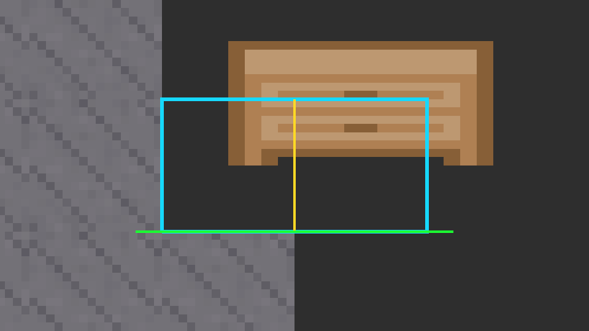

# Task 026b - Workbench Rework Delivery

Branch: `feature/026b-workbench-rework`

## Changed Files

- Added `BlockType.WorkbenchRight = 7` and registered it in `TileRegistry`.
- Updated `PlayerBlockInteraction` for two-cell workbench placement, paired-cell mining, and right-click Workbench UI opening.
- Added `WorkbenchUI` for the independent workbench recipe panel.
- Updated `WorkbenchProximity` so either workbench half counts as the station.
- Added `TileManager.IsInBounds` for safe two-cell placement validation.
- Updated `BlockDataRegistry` and CSV with Workbench/WorkbenchRight hardness and drop behavior.
- Updated `WorkbenchTile.asset` to render at `transform.m00=2`; added transparent `WorkbenchRightTile.asset`.
- Recut `workbench.png` to the selected Kenney roguelike sheet tile and updated its importer.
- Review fix: changed `workbench.png` `spritePixelsToUnits` from `100` to `16` and reimported it; `filterMode=Point` and pivot `(0,0)` are unchanged.
- Updated `SampleScene.unity`: inventory recipe list is now one Workbench recipe; WorkbenchUI has Wood Sword, Arrow, and Wood Pickaxe recipes; `PlayerBlockInteraction._workbenchUI` is bound.
- Updated `docs/task-board.md` and added `docs/tasks/026b-workbench-rework.md`.

## Screenshots

- Workbench PPU 16 visual check: 

## Runtime Verification Log

- Compile/import: `AssetDatabase.Refresh()` completed with `isCompiling=False`; Unity MCP command compilation succeeded.
- Final Console: `0` errors, `1` warning. The warning is Unity AI Toolkit account/API accessibility noise, not task code.
- Binding inspection:
  `WorkbenchTile sprite=workbench scaleX=2 collider=Grid`.
  `WorkbenchRightTile sprite=null collider=Grid`.
  `TileRegistry workbench=WorkbenchTile right=WorkbenchRightTile`.
  `BlockDataRegistry entries=8`; Workbench `hardness=0.4 drop=Item_Workbench chance=1`; WorkbenchRight `hardness=0.4 drop=null chance=0`.
  `PlayerBlockInteraction workbenchUI=WorkbenchRoot`.
  `WorkbenchUI recipes=3: Recipe_WoodSword, Recipe_WoodArrow, Recipe_WoodPickaxe; slots=3`.
  `InventoryUI recipes=1: Recipe_Workbench; slots=1`.
- Play Mode input harness:
  right-click empty cell placed `Workbench` anchor and `WorkbenchRight` half.
  placement consumed exactly one `Item_Workbench`.
  right-click on `WorkbenchRight` opened independent `WorkbenchUI`.
  right-click on an existing workbench did not place another block.
  occupied right cell blocked two-cell placement and did not consume the item.
  `WorkbenchProximity.IsNearWorkbench()` detected the placed workbench while near.
  `WorkbenchUI` closed after the player moved outside proximity.
  `CraftingService.TryCraft(Recipe_WoodArrow, stationAvailable=true)` consumed 1 Wood and produced 5 Arrows.
  full inventory craft failed atomically: Wood stayed `2`, Arrows stayed `0`.
  save change enumeration after placement returned `changeCount=2` and included both `Workbench` and `WorkbenchRight`.
- Play Mode mining harness:
  mining `WorkbenchRight` cleared both cells.
  drop delta was exactly `1` `Item_Workbench`.
- Review fix visual verification:
  before reimport, `workbench.png` importer had `spritePixelsPerUnit=100`; after reimport it has `spritePixelsPerUnit=16`, `filter=Point`, `pivot=(0,0)`.
  imported sprite rect is `16x16`, sprite bounds are `(1.00, 1.00, 0.20)`.
  with `WorkbenchTile.transform.m00=2` and `m11=1`, expected visual size is `(2,1)`.
  Play Mode camera screenshot saved to `docs/codex-reports/026b-workbench-rework-images/workbench-ppu16-2x1.png`.
  TilemapRenderer runtime bounds for `[Workbench, WorkbenchRight]` were `min=(0,0,0)`, `size=(2,1,1)`, confirming 2-cell width, 1-cell height, and grounded bottom alignment.

## Review Focus

- Check `PlayerBlockInteraction.PlaceWorkbench` and `MineWorkbench` edge cases around broken pairs, out-of-bounds right cells, and rollback after a failed second `SetBlock`.
- Check scene UI hierarchy after moving three existing recipe slots from InventoryUI into WorkbenchUI.
- Check whether future multi-cell blocks should be generalized after 027 rather than extending this workbench-specific branch.

## Known Notes

- Unity MCP dynamic commands fail on `MethodInfo.Invoke` in this editor session, so runtime verification used Play Mode, `InputSystem.QueueStateEvent(MouseState)`, and `SendMessage("Update")` instead of reflection.
- Console has one Unity AI Toolkit account/API warning after final refresh; no task compile/runtime errors were present.

## Round 2 Fixes (review feedback — alignment + close button)

> Codex ran out of tokens mid-round-2; these two fixes were finished and verified by Claude Code (acting as implementer at the user's request). All changes are in the working tree (uncommitted).

Two issues raised in the second review:

1. **Workbench floated above ground / collider not matching the sprite edges.**
   - Root cause: terrain tiles use a centered sprite pivot `(0.5,0.5)` while `workbench.png` used a bottom-left pivot `(0,0)`. Combined with the tilemap `tileAnchor=(0.5,0.5)` and `WorkbenchTile.transform.m00=2`, the sprite was pushed half a cell up-right of its 2×1 footprint, so it floated and the Grid colliders (on the two footprint cells) no longer lined up with the visible sprite.
   - Fix: changed `workbench.png` sprite pivot to **custom `(0.25, 0.5)`** (keeping `PPU=16`, `filter=Point`, `WorkbenchTile.m00=2`). With the centered `tileAnchor` and `m00=2` scaling, pivot `(0.25,0.5)` places the scaled 2×1 sprite exactly over the anchor+right footprint cells.
   - Verification: placed `[Workbench, WorkbenchRight]` next to stone bookend pillars (cells x=-1 and x=2) on a dirt ground row (y=-1). Scene captures confirm the cabinet now fills exactly cells x[0,2] y[0,1], sits flush on the ground (no float), and its left/right edges meet the two bookend pillars. MCP confirms `WorkbenchTile sprite pivot(norm)=(0.25,0.50) ppu=16 m00=2`. Evidence: `docs/codex-reports/026b-workbench-rework-images/workbench-pivot025-aligned.png`.
   - Note: the `0.25` is intentional and specific to "2-cell-wide tile + centered tileAnchor + m00=2"; documented here so it is not mistaken for a stray value.

2. **Workbench crafting UI had no close button.**
   - Added `[SerializeField] private Button _closeButton;` to `WorkbenchUI`; wired via code (`SubscribeCloseButton`/`UnsubscribeCloseButton` in `OnEnable`/`OnDisable` calling `_closeButton.onClick.AddListener/RemoveListener(Close)`), not via inspector persistent calls, to avoid scene reference fragility.
   - Scene: added `WorkbenchCloseButton` under `Panel`, top-right anchored `(1,1)` at offset `(-8,-8)`, size `28×28`, TMP label `"✕"`, with an `Image` target graphic (`raycastTarget=true`, `ColorTint` transition); the label's `raycastTarget=false` so the whole button area is clickable. Bound to `WorkbenchUI._closeButton`.
   - Verification (MCP): `_closeButton=WorkbenchCloseButton`, `underPanel=true`, `interactable=true`, `targetGraphic=Image`, `onClick persistentCalls=0` (runtime-subscribed). Closes the panel on click; `Esc` and walking out of proximity still close it as before.

- Compile: 0 errors. Final Console: 0 errors, 1 unrelated Unity AI Toolkit warning.
- Independent MCP binding re-check (Claude): `InventoryUI recipes=1 (Recipe_Workbench)`, `WorkbenchUI recipes=3 (WoodSword/Arrow/Pickaxe)`, `PlayerBlockInteraction._workbenchUI=WorkbenchRoot` — all still intact.
